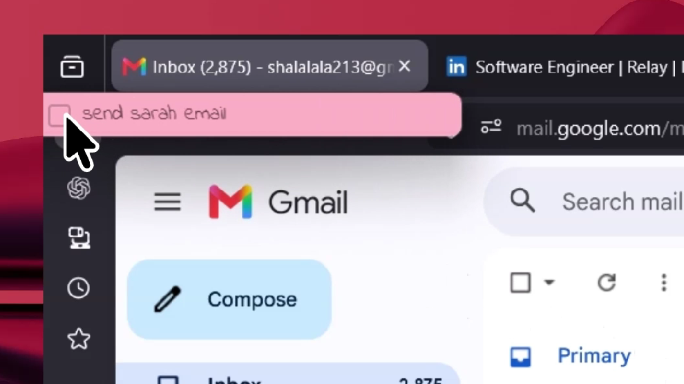
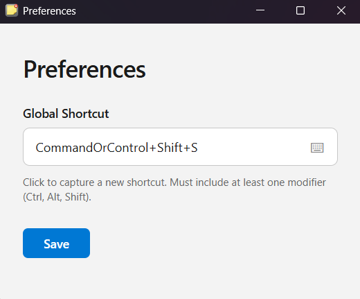
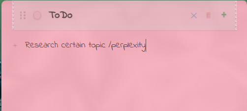

# Context Aware Sticky Note APP

A desktop sticky notes app with **context awareness** and **popup reminders**. Built with [Tauri 2](https://v2.tauri.app/), Rust, React, and TypeScript.

Each note is a **todo list** with its own window — styled like a real sticky note with handwritten fonts. An AI classifier assigns each todo a context (e.g., "github", "gmail", "vscode"), and a background window monitor watches your active application. When you switch to an app with matching todos, popup reminders slide onto your screen.

The app detects your current context and notifies you with the relevant tasks. You can hover with your mouse to reveal and it will auto hide later.

The default hotkey to bring up or hide the sticky notes is Ctrl+Shift+S. It can be changed in the peferences which can be found from the app's menu in system tray.

You can also force a context for a task by using /app_name or /site_name anywhere in the todo task.

