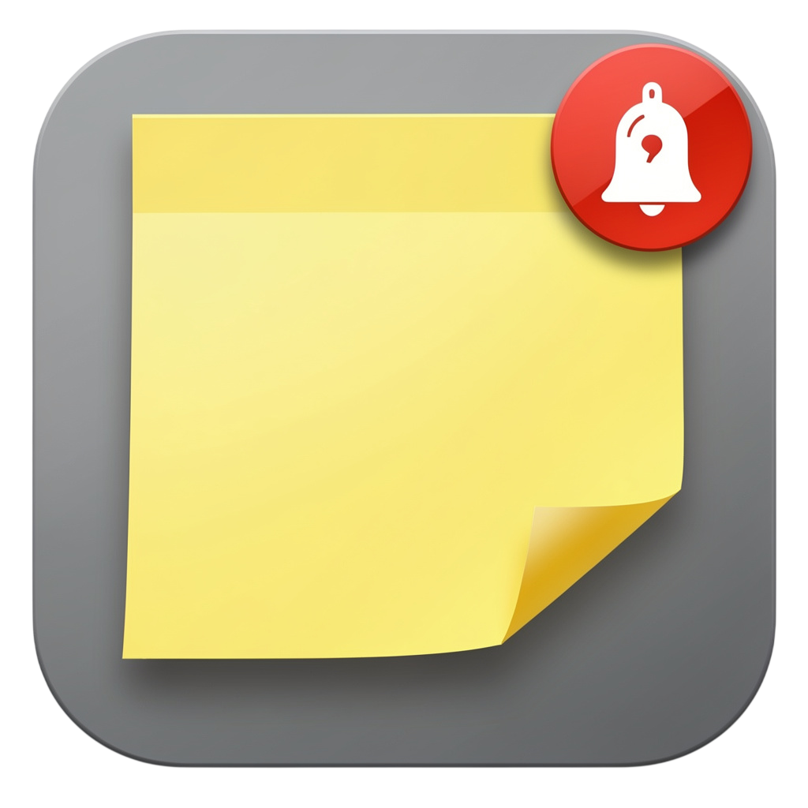
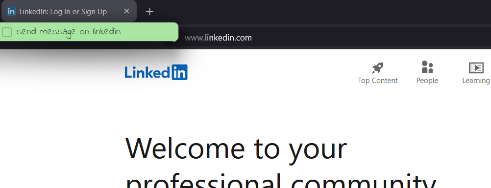
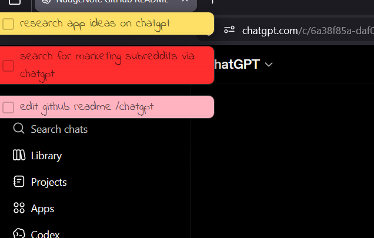

  

<h1 align="center">NudgeNote</h1>

  <b>A sticky note that nudges you throughout your work.</b>

  Turn your tasks into context aware reminders that resurface exactly when you need them.

  <a href="https://github.com/Kar-Sarthak/sticky/releases/download/v1.0.1/NudgeNote_1.0.1_x64-setup.exe"><b>⬇️ Download NudgeNote</b></a>

  ⭐ Star this repo if you want a MacOS version.

## ⚡ Your brain forgets. NudgeNote doesn’t.

Most todo apps assume you’ll remember to check them. *You won’t.*

NudgeNote flips the model: *Instead of you going to your tasks — your tasks come to you.*

---

## 🧩 How it works

1. Press **Ctrl + Shift + S**
2. Write your tasks naturally
3. Keep working normally
4. Watch tasks resurface at the right time

That’s it. No syncing. No friction. No “check your todo list”.

---

### 🌍 Context-aware reminders
NudgeNote knows what you’re doing.
So when the moment is right:
- Your tasks quietly reappear
- Only the relevant ones show up
- Nothing feels random or noisy

  

---

### 🔴 Priority that actually feels important
Not all tasks are equal.

- Seen tasks
- Unseen tasks
- 🔴 High-priority tasks that *demand attention*

  

---

### ⌨️ Special /commands
You can manually set context while writing tasks:

- `/app_name` (e.g `/perplexity`) → sets exact context  
- `/imp` → marks task as high priority  

---

### ✏️ You’re always in control
- Edit tasks anytime
- Override AI context with a click

---

### 🔔 Custom notifications preference
- Custom bounce intensity
- Cooldown timer to avoid repetition
- Calm when idle, active when needed

---

### 🖥️ Runs quietly in the background
NudgeNote stays out of your way and runs from the **system tray**, so it’s always available without cluttering your workspace.

---

## 📥 Get it

  <a href="YOUR_DOWNLOAD_LINK_HERE"><b>⬇️ Download NudgeNote</b></a>

---
